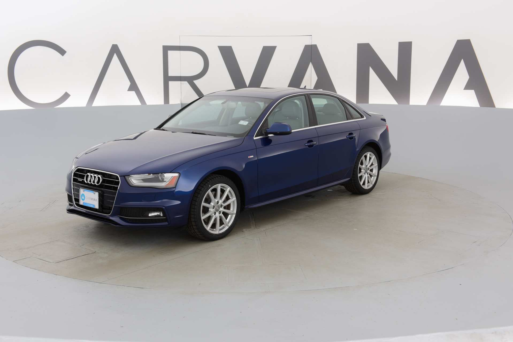
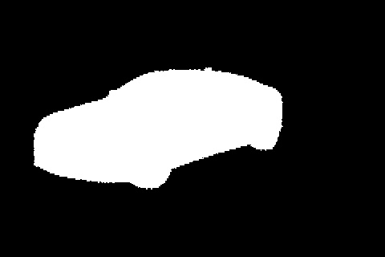

# A Segmentation project Based on Unet Deep learning neural Network

This is a computer vision project that focus on the image segmentation based on one deep learning neural network called Unet.

## About images we need to apply segmentation:
The image date I used is from here:

https://www.kaggle.com/c/carvana-image-masking-challenge

This is a simple vehicle image dataset which usually contains one single vehicle from different view angles in a single image. 

And the mask images simply identify the background and the vehicles in the images.

This dataset contains about 5000 images and their related mask images. About 10% Images are randomly chosen as the validation set and rest of them are used as train set.

## training and testing:
The train.py will build a new Unet model and load and train all images in the "train" folder. During the training, it will print and write the train loss and accuracy based on validation set to the tensorboard after a certain amount of images are trained. It also save the prediction images from train set periodically into the folder "saved_result" and the model in pt format in the "saved_model" folder. 

## Results:
These results are generated after the model is trained after 2 epochs.

Train_loss:

Accuracy based on validation set:

The prediction images and mask images after 240 images are trained:

The prediction image and mask image after 9120 images are trained:

